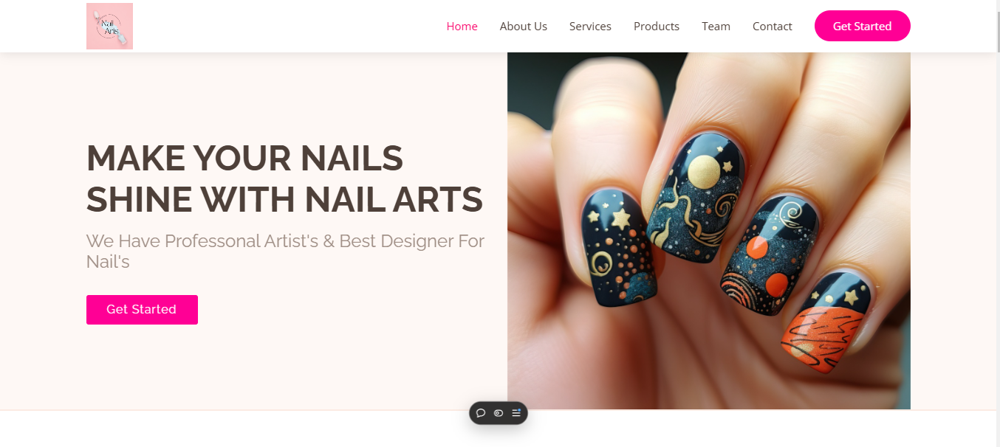

<h1>Nail Art Showcase</h1>

<h2>About the Project</h2>

Nail Art Showcase is a visually appealing gallery-style layout that displays a variety of creative and artistic nail designs. Built with HTML and CSS, this project is designed with a focus on responsive design principles to ensure a smooth viewing experience across different devices, from mobile phones to desktops.

<h2>Technologies Used</h2>
<ul>
    <li><strong>HTML:</strong> For structuring the content of the webpage.</li>
    <li><strong>CSS:</strong> For styling the webpage, creating a responsive layout, and enhancing the overall design.</li>
</ul>

<h2>Features</h2>
<ul>
    <li><strong>Gallery Layout:</strong> Displays a collection of stunning nail art designs in a clean and attractive grid format.</li>
    <li><strong>Responsive Design:</strong> Ensures that the website is optimized for various screen sizes, offering an enjoyable experience on desktops, tablets, and smartphones.</li>
    <li><strong>Minimalistic UI:</strong> A user-friendly interface that allows visitors to explore the nail art designs without distractions.</li>
</ul>

<h2>Team Members</h2>

This project was developed collaboratively by the following team members:

<ul>
    <li>Sufiyan Imran</li>
    <li>Daniyal Javadia</li>
    <li>Alishan</li>
    <li>Abdul Ahad</li>
</ul>

<h2>How to Run the Project</h2>
<ol>
    <li>Clone this repository to your local machine.</li>
    <li>Open the index.html file in any browser to view the project.</li>
</ol>
<pre><code>git clone &lt;repository-url&gt;
cd &lt;project-directory&gt;
open index.html</code></pre>

<h2>Contact</h2>

If you have any questions or would like to get in touch, feel free to contact me at:

Email: <a href="mailto:daniyaljavadiaworks@gmail.com">daniyaljavadiaworks@gmail.com</a>

<h2>Contributing</h2>

Feel free to contribute to this project! You can submit a pull request with improvements or suggest any changes that can make this project even better.
